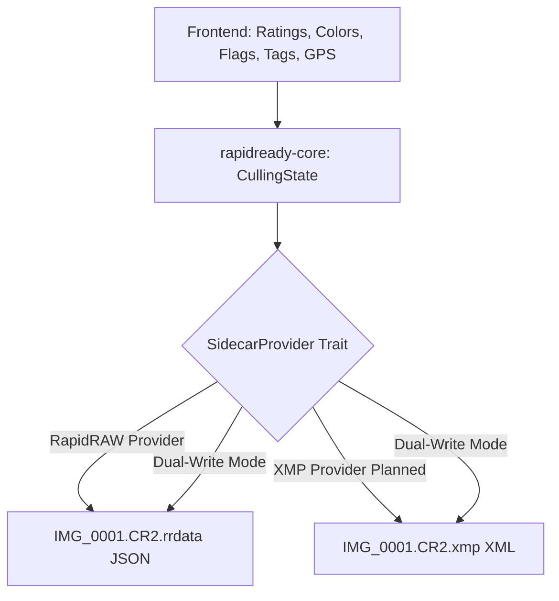

# RapidReady — Architecture Guide

> **System Design & Core Architecture Documentation**

---

## 1. Core Stack & Decision Record

| Component | Choice | Rationale |
|-----------|--------|-----------|
| **Application Framework** | **Tauri v2** | Native OS footprint (< 15 MB), blazingly fast memory-mapped file access, multi-platform support (macOS Apple Silicon/Intel, Windows x64, Linux). |
| **Backend Language** | **Rust 2024** | Zero-cost abstractions, fearless concurrency with Rayon & Tokio, direct byte-level EXIF/RAW parsing without GC pause. |
| **Frontend Framework** | **React 19 + TypeScript** | Strict type safety, clean component lifecycle, high developer ergonomics. |
| **State Management** | **Zustand** | Minimalist, unopinionated, high-performance state store with native slice subscriptions avoiding unnecessary re-renders. |
| **Styling** | **Tailwind CSS v4** | Hardware-accelerated CSS variables, consistent dark theme design tokens, zero runtime CSS overhead. |
| **Virtualization** | **TanStack Virtual v3** | Smooth 60 FPS virtualization across thousands of grid thumbnails and filmstrip items. |
| **Licensing** | **MIT License** | Maximum flexibility for open-source adoption and collaboration with the RapidRAW ecosystem. |

---

## 2. Workspace & Crate Structure

The repository is structured as a clean separation between the frontend presentation layer and the high-performance native Rust core:

```
app/
├── docs/                               # Architecture, Roadmap, Platform Guides
│   ├── ARCHITECTURE.md                 # This document
│   ├── ROADMAP.md                      # Technical roadmap & backlog
│   ├── PLATFORM_MACOS.md               # macOS build & packaging instructions
│   ├── PLATFORM_WINDOWS.md             # Windows build & setup instructions
│   ├── PLATFORM_LINUX.md               # Linux packaging instructions
│   └── VERSIONING.md                   # Semantic versioning & build numbers
├── scripts/                            # One-click developer & release scripts
│   ├── dev.sh / dev.bat                # Dev server launchers
│   ├── build-dmg.sh / build-installer.bat # Production release packaging
│   ├── bump-build.js                   # Automated build number incrementer
│   └── set-version.js                  # Synchronous version bumper
├── src/                                # React 19 Frontend
│   ├── components/                     # Modular UI components (views, layout, ui)
│   ├── stores/                         # Zustand stores (libraryStore, importStore, settingsStore)
│   ├── locales/                        # Bilingual translations (en, de)
│   └── utils/                          # Frontend helpers (image URLs, normalizers)
├── src-tauri/                          # Tauri v2 Desktop Shell
│   ├── Cargo.toml                      # Main Tauri binary crate
│   ├── src/
│   │   ├── lib.rs                      # Tauri runtime setup & custom protocol handlers
│   │   ├── commands.rs                 # IPC command handlers invoked from React
│   │   └── main.rs                     # Platform entrypoint
│   └── crates/
│       └── rapidready-core/            # Standalone, reusable Rust business logic
│           ├── Cargo.toml
│           └── src/
│               ├── archive.rs          # Recursive filesystem scanner with ScanController
│               ├── culling.rs          # Atomic sidecar I/O and RapidRAW state adapter
│               ├── date_resolver.rs    # Multi-tier EXIF/file creation date resolution
│               ├── import_index.rs     # SQLite hash-based duplicate prevention
│               ├── metadata_resolver.rs# Single-pass EXIF, GPS, and monochrome detection
│               ├── scanner.rs          # Memory card & folder media ingestion scanner
│               └── thumbnail.rs        # Embedded RAW JPEG extractor & multi-scale cache
├── package.json                        # Node dependencies and build scripts
└── CONTRIBUTING.md                     # Contributor onboarding guide
```

---

## 3. High-Performance Core Pipelines

### A. Progressive RAW Preview Extraction
RapidReady bypasses slow full-sensor RAW demosaicing for grid navigation:
1. **Tiered Header Streaming:** Uses 256 KB slices to locate EXIF metadata and IFD1 embedded previews in sub-millisecond time.
2. **Direct Bitstream Passthrough:** Extracts the camera's embedded preview JPEG directly from the RAW container and streams it to the WebView.
3. **Orientation Injection:** If an image is shot in portrait orientation, RapidReady injects the EXIF orientation tag into the JPEG header stream on the fly (0.001 ms), completely avoiding lossy image decoding and re-compression.

### B. Two-Phase Progressive NAS Scanning
Scanning massive photo archives (e.g. 500+ GB) across network shares (SMB/NFS) avoids locking the UI:
1. **Phase 1 (300 ms Debounce):** Local NVMe SSDs respond in < 50 ms and show no spinner. If a network drive takes longer, an interactive connecting dialog appears with cancellation controls.
2. **Phase 2 (Progressive Streaming):** As soon as the first chunk of 100 images arrives, thumbnails render immediately in the grid.
3. **Pause/Resume via Condvar:** Pausing a scan puts the background thread into a zero-CPU state using a Rust `Condvar`.

### C. Data Integrity & Atomic Sidecars
All culling operations (picks, rejects, star ratings, color labels, tags, GPS coordinates) are saved non-destructively:
- The camera RAW file is **never written to or modified**.
- Metadata is written to a unique temporary file (`.{stem}.tmp.{thread_id}.{pid}`) and atomically moved to the destination (`.rrdata` / `.xmp`) via `std::fs::rename`. This eliminates file corruption even in the event of an abrupt app crash, power cut, or network share disconnect.

---

## 4. Multi-RAW Sidecar Provider Strategy

RapidReady employs the **Adapter Pattern** to bridge different RAW processors:



1. **Internal State Representation:** The Rust core and React stores maintain a clean internal model: `flag: Option<i8>`, `rating: u8`, `color: Option<String>`, `tags: Vec<String>`, and `gps: Option<GpsCoordinates>`.
2. **Pluggable Sidecars:** While the initial release focuses on RapidRAW compatibility (`.rrdata`), the architecture is designed to support standard Adobe `.xmp` sidecars via a pluggable `SidecarProvider` trait, enabling simultaneous dual-write workflows for Adobe Lightroom Classic, Capture One, and Darktable.
