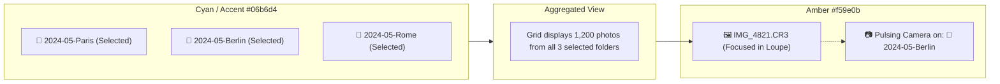

# RapidReady — GUI Styleguide & Interaction Semantics

> **Authoritative Visual Design, Color Tokens & Interaction Semantics for RapidReady**
> 
> *Binding reference for core developers, UI designers, and open-source contributors.*

---

## 1. Design Philosophy

RapidReady is built specifically for **high-volume professional photographers** ingesting and culling tens of thousands of RAW photos in single sessions. 

The GUI follows three inviolable principles:
1. **Zero Chromatic Bias**: The canvas and photo viewing areas use calibrated, deep neutral-dark tones (`#0c0c0e`) to prevent optical eye fatigue and ensure accurate perception of color temperature, exposure, and dynamic range.
2. **Crystal-Clear Semantic Separation**: Selection state, physical photo location, culling flags (Pick/Reject), and destructive warnings must never share the same color or visual weight.
3. **Safety-First Modals**: Destructive file operations must never be accidentally triggerable via rapid keystrokes or ambiguous UI cues.

---

## 2. Core Color Palette & Design Tokens

Defined in [`app/src/App.css`](../src/App.css) and exposed via Tailwind CSS v4 variables:

| Token Name | Hex / Value | Tailwind Class | Semantic Meaning |
|---|---|---|---|
| `--color-accent` | `#06b6d4` | `text-accent`, `bg-accent`, `border-accent` | **Selection & Active Workspace State** (Folders, Grid, Filmstrip, Toggles) |
| `--color-accent-hover` | `#22d3ee` | `hover:text-accent-hover` | Interactive hover for selected/accent elements |
| `--color-accent-glow` | `rgba(6, 182, 212, 0.15)` | `pulse-glow` | Soft glow effect on active states |
| `--color-warning` | `#f59e0b` | `text-warning`, `text-amber-400` | **Photo Focus & Origin Location** (Pulsing Camera), Star Ratings (1–5★) |
| `--color-success` | `#22c55e` | `text-success`, `bg-success` | **Pick Flag [P]**, Approval, Retention, Successful Ingest / Completion |
| `--color-danger` | `#ef4444` | `text-danger`, `bg-danger` | **Reject Flag [X]**, Destructive Deletion, Errors & Permanent Warnings |
| `--color-indigo` | `#6366f1` | `text-indigo`, `bg-indigo` | Secondary utility badges (Import source, metadata badges) |
| `--color-app-deepest` | `#0c0c0e` | `bg-app-deepest` | Deepest canvas (Main photo viewer / Loupe backdrop) |
| `--color-app-panel` | `#151518` | `bg-app-panel` | Sidebar & panel surfaces |
| `--color-app-card` | `#1c1c21` | `bg-app-card` | Cards, toolbar containers, dialog surfaces |
| `--color-app-hover` | `#252529` | `bg-app-hover` | Subtle row hover / clickable item hover |
| `--color-app-border` | `#2a2a30` | `border-app-border` | Default crisp structural borders & dividers |
| `--color-txt-primary` | `#e8e8ec` | `text-txt-primary` | High-contrast body text & active labels |
| `--color-txt-secondary` | `#8b8b95` | `text-txt-secondary` | Secondary metadata, inactive folder labels |
| `--color-txt-tertiary` | `#5c5c66` | `text-txt-tertiary` | Item counts, chevrons, keyboard shortcut hints |

---

## 3. Visual Semantics Breakdown

### 3.1. Blau-Türkis / Cyan (`--color-accent` / `#06b6d4`) → **Selection & Active State**
Cyan is the **sole indicator of user selection** across the entire application.

- **Library Folder Tree**:
  - Selected folder node: `bg-accent/15 text-accent font-semibold`.
  - Selected folder icon: `text-accent`.
  - Multi-selected folders: Every folder in the active selection set receives the exact same cyan highlight.
- **Grid & Filmstrip View**:
  - Selected photo thumbnail(s): High-contrast cyan outline (`box-shadow: 0 0 0 2px var(--color-accent)` or `ring-2 ring-accent`).
  - Selection checkboxes: `bg-accent border-accent`.
- **UI Controls & Navigation**:
  - Active toggle switches: `.toggle-track.on { background: var(--color-accent); }`.
  - Active filter mode pills (e.g. *All*, *Picks*, *Rejected*).
  - Progress bar shimmer fill.

> [!NOTE]
> **Why Cyan?** Cyan is absent from natural skin tones and photographic neutral grays, making it instantly recognizable without interfering with photographic color judgment. It must **never** be used to indicate warnings, errors, or file ratings.

---

### 3.2. Warmes Gold / Amber (`--color-warning` / `#f59e0b` / `text-amber-400`) → **Photo Focus & Physical Origin**
Amber/Gold represents **where the camera or viewer currently is situated**.

- **The Pulsing Camera Icon (`Camera` in Folder Tree)**:
  - Displays next to the exact folder that physically contains the photo currently loaded in the Loupe or Inspector.
  - Rendered with an animated pulse: `<Camera className="w-3 h-3 animate-pulse text-amber-400" />`.
  - **Bubble-Up Rule**: If the photo's actual parent folder is collapsed inside an ancestor folder, the ancestor folder displays the camera badge and a subtle warm highlight (`bg-amber-400/10 text-txt-primary font-medium`). This guarantees the photographer never loses track of a photo's origin in deep directory hierarchies.
- **Default Folder Aesthetic**:
  - Unselected folders in the tree render with `text-warning/70` (warm folder tone) for immediate visual affordance, transitioning to `text-accent` only when selected.
- **Star Ratings (1 to 5 Stars)**:
  - Rated photos display 1–5 amber stars (`text-amber-400`).
  - Star hover states expand slightly (`scale-115`).
- **Auto-Advance Indicator**:
  - When auto-advance is enabled during culling, the lightning bolt badge activates in amber.

---

### 3.3. Emerald Grün (`--color-success` / `#22c55e`) → **Approval & Retention ("Pick")**
Green represents positive culling retention and completed workflows.

- **Pick Flag (`P` / Up Arrow)**:
  - Pick badge `[ P ]` on grid thumbnails and the Loupe HUD.
  - **Pick Flash Animation (`pick-flash`)**: A brief 350ms green glow (`rgba(34, 197, 94, 0.35)`) inside the thumbnail border when the photographer flags a photo as Pick.
- **Success Confirmations**:
  - Completed ingestion checks, batch operation completion toasts, verified hash badges.

---

### 3.4. Signalrot (`--color-danger` / `#ef4444`) → **Rejection ("Reject") & Destruction**
Red represents discarded assets, file deletion, and dangerous operations.

- **Reject Flag (`X` / Down Arrow)**:
  - Reject badge `[ X ]` on grid thumbnails.
  - **Reject Flash Animation (`reject-flash`)**: A brief 350ms red glow (`rgba(239, 68, 68, 0.35)`) on keystroke.
  - **Translucent Rejected Overlay**: Rejected thumbnails are desaturated and dimmed:
    ```css
    .thumb-rejected { opacity: 0.4; filter: saturate(0.3); }
    .thumb-rejected-overlay { background: rgba(239, 68, 68, 0.12); }
    ```
- **Destructive Deletion**:
  - "Ordner löschen..." / "Delete Folder..." entries in context menus.
  - "Nur verworfene Bilder (X) löschen..." actions.

---

### 3.5. Industry-Standard Color Labels (Keys 6–9)
Following Lightroom and Capture One conventions:
- **Key 6**: Rot (`#ef4444`)
- **Key 7**: Gelb / Amber (`#f59e0b`)
- **Key 8**: Grün (`#22c55e`)
- **Key 9**: Blau (`#3b82f6`)

---

## 4. Selection vs. Focus Decoupling

A fundamental concept in RapidReady is that **Folder Tree Selection** and **Active Photo Location** are **completely decoupled**:



1. **Selection (Cyan)** defines the **scope of the grid**: which folders' contents are aggregated and shown.
2. **Focus (Amber Camera)** identifies the **physical origin of the single photo** currently under the loupe or inspector.

---

## 5. Interaction Patterns & Rules

### 5.1. Tree Selection Modifiers
- **Click**: Selects the clicked folder (and all its recursive subfolders) as the active selection, clearing prior selections.
- **Shift + Click**: Selects a contiguous range of visible tree nodes between the anchor node and the clicked node.
- **Cmd + Click (macOS) / Ctrl + Click (Windows/Linux)**: Toggles individual folders in or out of the selection set without resetting the rest.

### 5.2. Context Menu Conventions
When right-clicking in the folder tree:
- **Single-Tree / Single-Folder Mode (`topSelectedPaths.length <= 1`)**:
  - **Reveal in Finder / Explorer**: Active and targets the clicked folder node.
  - **New Subfolder**: Active and explicitly named (`Neuer Unterordner in „{nodeName}“...` / `New Subfolder in "{nodeName}"...`).
- **Multi-Tree Batch Mode (`topSelectedPaths.length > 1`)**:
  - **Reveal in Finder / Explorer**: **Hidden** (prevents kaskadierende Finder-Fenster und unklare Fokus-Zustände bei disjunkten Ordnern).
  - **New Subfolder**: **Hidden** (singuläre Erstellung gehört nicht in ein Multi-Objekt-Batchmenü).
  - **Active Batch Operations**: *Alle Fotos in den X Ordnern auswählen*, *Ausgewählte Ordner aufklappen/einklappen*, *Nur verworfene Bilder in Auswahl löschen...*, *X ausgewählte Ordner löschen...*.

### 5.3. Safety-First Modal Confirmation Policy
Whenever a dialog prompts the user to delete files or folders:

> [!CAUTION]
> **MANDATORY SAFETY RULE FOR CONTRIBUTORS**:
> On all destructive confirmation modals ("Permanently delete...", "Ordner unwiderruflich löschen..."), the **Default focused button MUST ALWAYS be "Cancel" ("Abbrechen")**.
>
> The destructive "Delete" action must:
> 1. Use the danger color token (`bg-danger` or `hover:bg-danger/20 text-danger`).
> 2. NEVER be the default focused button receiving an accidental `Enter` keypress.

---

## 6. Bilingual Terminology (Glossary)

| Concept | German (`de`) | English (`en`) |
|---|---|---|
| Ingest | Import / Einlesen | Ingest / Import |
| Culling | Ausmisten / Culling | Culling |
| Pick | Auswahl / Behalten | Pick |
| Reject | Verworfen | Reject |
| Loupe View | Lupe / Großansicht | Loupe View |
| Filmstrip | Filmstreifen | Filmstrip |
| Sidecar File | Sidecar-Datei (`.xmp` / `.rr`) | Sidecar File |
| Subfolder | Unterordner | Subfolder |
| Reveal in Finder | Im Finder anzeigen | Reveal in Finder |
| Show in Explorer | Im Explorer anzeigen | Show in Explorer |
